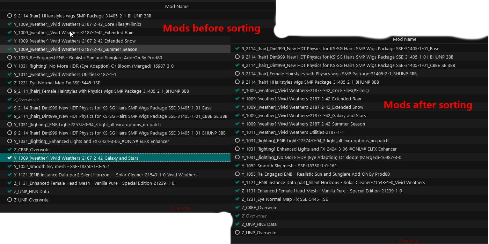
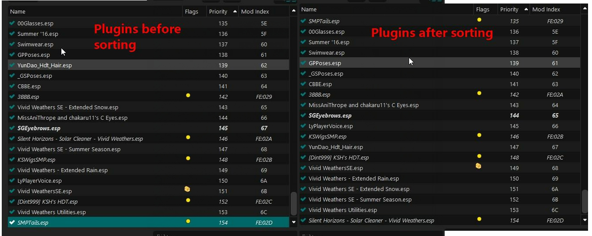
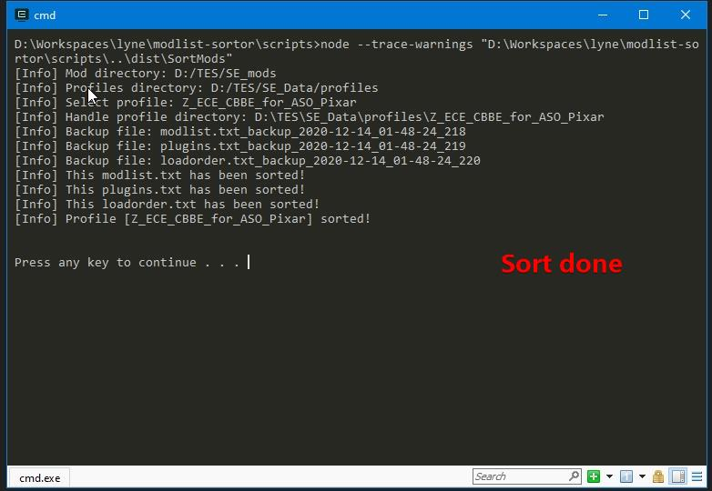

# mods-and-plugins-sortor

Sort the mods and plugins of the profiles of Mod Organizer 2, let the mod's name determine it's priority.

## Requirement

- [**Node.js**](nodejs.org)

  I use write the project by TypeScrpit, which can be compiled to JavaScript.
  
  Node.js is a JavaScript runtime, download and install it.
  
  I'm sorry for that. I am a JavaScript developer, not C++.
- [**Mod Organizer 2 v2.3.0 +**](https://www.nexusmods.com/skyrimspecialedition/mods/6194)

  Only support MO2, not Mod Organizer 1 Legacy.

  I use Mod Organizer 2 v2.3.0, work well.

  I did not test old versions of Mod Organizer 2.

- **MO2 Portable instance**

  I just used MO2 Portable instance, not support non portable instance.

- No unmanaged plugins or masters, except five Vallina master

- the name of plugin not start with "\*"

## Features

### Sort mods

The mod's name determine it's priority, just use [String.prototype.localeCompare()](https://developer.mozilla.org/en-US/docs/Web/JavaScript/Reference/Global_Objects/String/localeCompare), like the Windows Explorer list files by name.


There five mods, each has at least one prefix.

```txt
0_0731_[fix]_Unofficial Chinese Translation for Skyrim Special Edition (CHS)-1333-8-19_Standard_Textures
2_[UI]_Favorite Things - Extended Favorites Menu for SkyUI - Superior Favorites-27177-1-0
3_#LE2SE#_Smile To Camera-92337-0-4 by lyne408
4_1101_[architecture]_#LE2SE#_06_AIT Architectures - Windhelm
9_1451_[brow]_SG Female Eyebrows SE-25890-2-0
```


Like the above mods' names, I personally use at least one category mark and at least one sort mark as the prefix of a mod.
I let the category marks and sort marks determine a mod's priority.
Such as "9_1451_\[brow]\_", "9" means it's female's meshes and textures, "1451" means female's eyebrows, "[brow]" is better for filter.


Everyone has his methods to manage resources, those prefix and this project is my personal way to manage the mods' priority. 




### Sort plugins

The mod's name determine it's plugins priority.

This feature is optional, enabled by default.




### Backup before sorting

Before sorting, the program will backup the modlist.txt, plugins.txt, loadorder.txt file.

The name of backup file is like modlist.txt_backup_2020-05-29_17-53-12_955.

This feature is optional, enabled by default.

## Usage

1. Instanll **Node.js**.

    If downloaded the Node.js Windows Installer, used default options to install it,  Node will automatically add it's installation directory to `PATH` environment.

    Ensure the parent directory of `node.exe` is in your `PATH` environment.

    If added, open cmd.exe, execute `node`, you'll get message like:
    
    ```txt
    Welcome to Node.js v14.15.1.
    Type ".help" for more information.
    >
    ```
    If not, add it your self.
    
2. Instanll **Mod Organizer 2**, when first running, choose **Portable** mode.
	
	En, I just use MO2 **Portable** instance.
	Open files tab of the webpage of Mod Organizer 2, recommemd download the file "Mod Organizer 2 (Archive)".
	Ensure choose **Portable** mode, because the project just support MO2 **Portable** instance.

3. Download the latest release and extract it.

4. Config the installation path of your MO2 portable instance

5. Open `dist/SortModsAndPlugins.js` of your extracted directory, which contains the following JavaScript code: 

    ```javascript
    const moTwoInstallationDirectory = 'D:\\TES\\SE_Program\\Mod Organizer 2 (Archive)-6194-2-3-0';
    ```
    Change  "D:\\TES\\SE_Program\\Mod Organizer 2 (Archive)-6194-2-3-0"  to yours.

    Note:

    - Use "\\\\" as path separator.
    - Ensure it was quoted by '.

    Then save.

6. Execute `scripts/SortModsAndPlugins.bat` of your extracted directory, then will sort the selected profile.

    

7. After sorting, reload selected profile(such as switch to another profile then switch back).

## Configuration

Open `dist/SortModsAndPlugins.js` of your extracted directory, which contains the following JavaScript code:

```JavaScript
const moTwoInstallationDirectory = 'D:\\TES\\SE_Program\\Mod Organizer 2 (Archive)-6194-2-3-0';
const config = {
    moTwoInstallationDirectory,
    isSortAllProfiles: false,
    isOnlySortSelectedProfile: true,
    isBackup: true,
    isSortPlugins: true
};
```


If you don't need backup, set `isBackup` to `false`, then you will get the line like this:

```javascript
isBackup: false,
```


If you want to sort all profiles, set `isSortAllProfiles` to `true`,  then you get the line like this, then `isOnlySortSelectedProfile` will be ignored:

```JavaScript
isSortAllProfiles: true,
```


If  you just want to sort mods, but not plugins, set `isSortPlugins` to false, then you get the line like this:

```JavaScript
isSortPlugins: false
```


See the following TypeScript code for more infomations.

```typescript
type SortProfilesByConfigParameter = {
	/**
	 * MO2 Portable installation directory
	 * <necessity required />
	 */
	moTwoInstallationDirectory: string
	/**
	 * determine whether to sort all profiles
	 *
	 * <necessity optional />
	 *
	 * <ignoreProperties>
	 *		<condition value="true" />
	 *		<property name="isOnlySortSelectedProfile" />
	 * </ignoreProperties>
	 */
	isSortAllProfiles?: boolean
	/**
	 * determine whether to only sort selected profile
	 *
	 * <necessity optional />
	 *
	 * <propertyDependencies>
	 *     <condition value="true" />
	 *     <property name="isSortAllProfiles" value="false" />
	 * </propertyDependencies>
	 *
	 */
	isOnlySortSelectedProfile?: boolean,
	/**
	 * determine whether to backup files
	 * <necessity optional />
	 */
	isBackup?:boolean
	/**
	 * determine whether to sort plugins
	 * <necessity optional />
	 */
	isSortPlugins?: boolean
}
```


