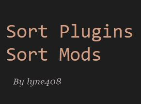
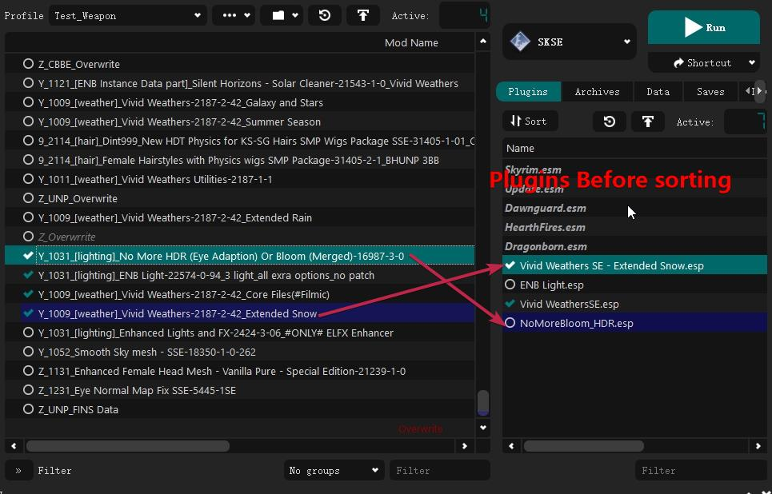
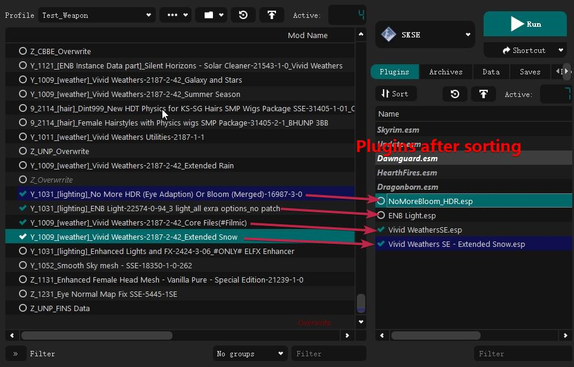
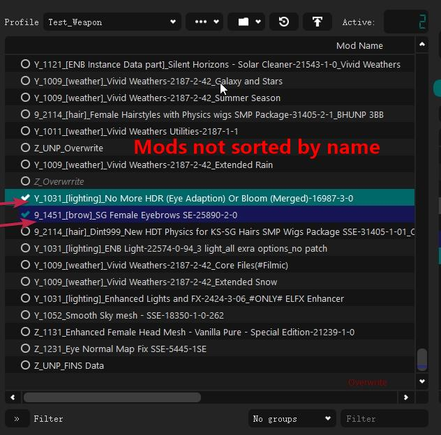
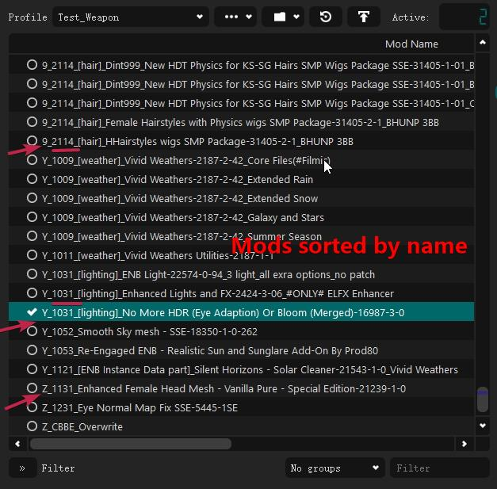
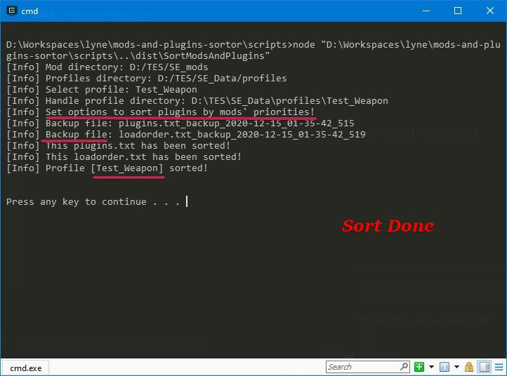

[TOC]

<!-- toc -->

- [mods-and-plugins-sortor](#mods-and-plugins-sortor)
  * [What's this project?](#whats-this-project)
    + [Sort the plugins](#sort-the-plugins)
    + [Sort the mods](#sort-the-mods)
    + [Is this meant to replace LOOT?](#is-this-meant-to-replace-loot)
  * [Requirement](#requirement)
  * [Features](#features)
    + [Sort plugins](#sort-plugins)
    + [Sort mods](#sort-mods)
      - [Why add this feature?](#why-add-this-feature)
      - [Category Marks and Order Marks](#category-marks-and-order-marks)
      - [The Ways to Manage Resources](#the-ways-to-manage-resources)
    + [Backup before sorting](#backup-before-sorting)
  * [Usage](#usage)
  * [Configuration](#configuration)
  * [Changelog](#changelog)

<!-- tocstop -->

# mods-and-plugins-sortor

"mods-and-plugins-sortor" is a synonym for "Mods and Plugins Sortor for Mod Organizer 2".




## What's this project?

Sort the plugins in a profile of Mod Organizer 2, let the mod's priority determine it's plugins' priorities. Also support sort mods by name.    

"Mods and Plugins Sortor for Mod Organizer 2" is an utility for those person which prefer to sort mods and plugins **manually**.

### Sort the plugins

**Optional**, *enabled* by default.

Sort the plugins of the profiles of Mod Organizer 2, let the mod's priority determine it's plugins' priorities.

### Sort the mods

**Optional**, *disabled* by default.

Sort the mods of the profiles of Mod Organizer 2, let the mod's name determine it's priority.


If added **order marks** as prefixes of the mod name, it's suitable. Like the five mods' names following.

```text
0_0731_[fix]_Unofficial Chinese Translation for Skyrim Special Edition (CHS)-1333-8-19_Standard_Textures
2_[UI]_Favorite Things - Extended Favorites Menu for SkyUI - Superior Favorites-27177-1-0
3_#LE2SE#_Smile To Camera-92337-0-4 by lyne408
4_1101_[architecture]_#LE2SE#_06_AIT Architectures - Windhelm
9_1451_[brow]_SG Female Eyebrows SE-25890-2-0
```

If not, en, you may be not need this.

I thought most person not need this, so disabled by default.

### Is this meant to replace LOOT?

No, LOOT sorts plugins automatically by it's database no Github repository, so it's database determine the plugins' load orders.
This project is used to sort plugins by mods' priority, developed for those person which prefer sorting plugins **manually**. 

## Requirement

- [**Node.js**](nodejs.org)

  I use write the project by TypeScrpit, which can be compiled to JavaScript.
  
  Node.js is a JavaScript runtime, download and install it.
  
  I'm sorry for that. I am a JavaScript developer, not C++.
  
- [**Mod Organizer 2 v2.3.0 +**](https://www.nexusmods.com/skyrimspecialedition/mods/6194)

  Only support MO2, not Mod Organizer 1 Legacy.

  I use Mod Organizer 2 v2.3.0, work well.

  I did not test old versions of Mod Organizer 2.

- **MO2 Portable instance**

  I just used MO2 Portable instance, not support non portable instance.

- No unmanaged plugins or masters, except five Vallina master.

- The name of mod not start with "-" or "+".

- The name of plugin not start with "\*".

## Features

### Sort plugins

This feature is **optional**, *enabled* by default.

The mod's priority determine it's plugins priorities.


**Before sorting:**





**After sorting:**




### Sort mods

This feature is **optional**, *disabled* by default.

Let the mod's name determine it's priorities, just use [String.prototype.localeCompare()](https://developer.mozilla.org/en-US/docs/Web/JavaScript/Reference/Global_Objects/String/localeCompare), like the Windows Explorer lists files by name.

#### Why add this feature?

This feature is based on **INDEPENDENT CONCEPTS**.


---


The mods' priority should not depend on a mod manager.

If switch *Mod Manager*  to *Vortex* or other mod managers, there may be a problem how to recover original priorities.

If install many mods one hour, manually drag them to set their priorities may be a large work.

The mods themselves should determine their priorities.


*Vortex* don't support **Portable instance**.

Because it was developed with DEPENDENT concepts, means *system dependent*, if reinstalled Windows, all your User Data losted.

Also *Vortex* is an service of someone website, even open source, the most important is to provide service, not features.

So *Vortex* does not need to support portable instance.


----


Above all:

- So why use *Mod Manager* instead of *Vortex* or *NMM* ?

  Because it's user INDEPENDENT, system INDEPENDENT.

- So why add this feature?

  Let mods' priorities is **profile INDEPENDENT**, **mod manager INDEPENDENT**. 

  let the mods themselves determine their priorities.


----

#### Category Marks and Order Marks

There five mods, each name has at least one prefix.

```txt
0_0731_[fix]_Unofficial Chinese Translation for Skyrim Special Edition (CHS)-1333-8-19_Standard_Textures
2_[UI]_Favorite Things - Extended Favorites Menu for SkyUI - Superior Favorites-27177-1-0
3_#LE2SE#_Smile To Camera-92337-0-4 by lyne408
4_1101_[architecture]_#LE2SE#_06_AIT Architectures - Windhelm
9_1451_[brow]_SG Female Eyebrows SE-25890-2-0
```


Like the above mods' names, I personally use at least one **category mark** or at least one **order mark** as the prefix of a mod.
I let the category marks and sort marks determine a mod's priority.

Such as "2\_[UI]_", "2" is the order mark, means it's a user interface mod, "[UI]" is a category mark, it's better for filter.

Such as "9_1451_\[brow]\_", "9" is the order mark of female's meshes and textures, "1451" means female's eyebrows, "[brow]" is better for filter.

If sort by name, [fix] mods > [UI] mods >  [architecture] mods > [brow] mods.

After using *category marks* and *order marks*, the mods themselves determine their priorities.


**Before sorting:**




**After sorting:**



#### The Ways to Manage Resources

Everyone has his ways to manage resources, those prefixes and this feature are my personal ways to manage the mods' priorities.

If **DISAGREE** with *INDEPENDENT CONCEPTS*, you don't need this feature.

### Backup before sorting

This feature is **optional**, *enabled* by default.

Before sorting, the program will backup the modlist.txt, plugins.txt, loadorder.txt file.

The name of backup file is like `modlist.txt_backup_2020-05-29_17-53-12_955`.

## Usage

1. Instanll **Node.js**.

    If downloaded the Node.js Windows Installer, used default options to install it,  Node will automatically add it's installation directory to `PATH` environment.

    Ensure the parent directory of `node.exe` is in your `PATH` environment.

    If added, open cmd.exe, execute `node`, you'll get message like:
    
    ```text
    Welcome to Node.js v14.15.1.
    Type ".help" for more information.
    >
    ```
    If not, add it your self.
    
2. Instanll **Mod Organizer 2**, when first running, choose **Portable** mode.
	
	En, I just use MO2 **Portable** instance.
	Open files tab of the webpage of Mod Organizer 2, recommemd download the file "Mod Organizer 2 (Archive)".
	Ensure choose **Portable** mode, because the project just support MO2 **Portable** instance.

3. Download the latest release and extract it.

4. Config the installation path of your MO2 portable instance

    Open `dist/SortModsAndPlugins.js` of your extracted directory, which contains the following JavaScript code: 

    ```javascript
    const moTwoInstallationDirectory = 'D:\\TES\\SE_Program\\Mod Organizer 2 (Archive)-6194-2-3-0';
    ```
    Change  "D:\\TES\\SE_Program\\Mod Organizer 2 (Archive)-6194-2-3-0"  to yours.

    **Note**:

    - Use "\\\\" as path separator.
    - Ensure it was quoted by '.

    Then save.

5. Execute `scripts/SortModsAndPlugins.bat` of your extracted directory, then will sort the selected profile.

    Afater sorting done, like this window.

    

6. After sorting, reload selected profile(such as switch to another profile then switch back).

## Configuration

Open `dist/SortModsAndPlugins.js` of your extracted directory, which contains the following JavaScript code:

```JavaScript
const moTwoInstallationDirectory = 'D:\\TES\\SE_Program\\Mod Organizer 2 (Archive)-6194-2-3-0';
const config = {
    moTwoInstallationDirectory,
    isSortAllProfiles: false,
    isOnlySortSelectedProfile: true,
    isBackup: true,
    isSortModsByName: false,
    isSortPlugins: true
};
```


If you don't need backup, set `isBackup` to `false`, then you will get the line like this:

```javascript
isBackup: false,
```


If you want to sort all profiles, set `isSortAllProfiles` to `true`,  then you get the line like this, then `isOnlySortSelectedProfile` will be ignored:

```JavaScript
isSortAllProfiles: true,
```


If you want to sort mods by name, set `isSortModsByName` to true:

```JavaScript
 isSortModsByName: true,
```

## Changelog

I write changelog in a separate document. 

See `docs/Changelog.md`.

[Changelog](./docs/Changlog.md)